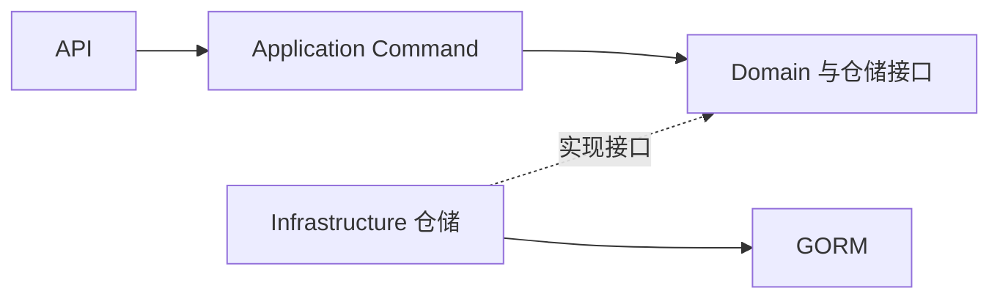

# DDD项目实践笔记

DDD 的几个常见概念——实体、值对象、聚合、仓储——单独看都不难理解。落到一个 Go 项目里，容易拿不准的反而是一些很具体的事：标题校验放在哪儿？查文章详情要不要经过领域对象？同一篇文章为什么有好几个结构体？

这篇笔记结合一个个人博客后端，把这些问题串起来。项目主要有文章和动态两个模块，使用标准库 HTTP、Huma、GORM 和 PostgreSQL。业务不复杂，适合顺着代码观察这些设计各自解决了什么问题。

文中的例子以文章模块为主。源码路径相对于 `backend/`，代码片段省略了部分导入和上下文。

## 目录

1. [先把几个概念放到一起看](#overview)
2. [项目整体结构](#modules)
3. [模块化单体：按业务组织一个应用](#modular-monolith)
4. [实体、值对象和聚合](#domain)
5. [分层之后，代码依赖谁](#dependencies)
6. [一篇文章为什么有多种模型](#models)
7. [从创建到修改，走一遍写入流程](#write)
8. [CQRS：把读和写各自关心的事分开](#query)
9. [校验封装：把规则留在业务代码里](#validation)
10. [错误怎样变成 HTTP 响应](#errors)
11. [分层做到什么程度合适](#choices)
12. [源码阅读索引](#source-index)
13. [下一个计划](#next-plan)

<a id="overview"></a>

## 1. 先把几个概念放到一起看

项目里同时用到了 DDD、模块化单体、整洁架构和 CQRS。它们经常一起出现，不过各自关注的事情不同。

| 概念 | 关注的问题 | 项目中的例子 |
| --- | --- | --- |
| DDD | 怎样用代码表达业务概念和规则 | 文章、标题、分类，以及修改它们的行为 |
| 模块化单体 | 一个应用内部怎样按业务划分 | `article` 和 `feed` 分开组织，共同运行 |
| 整洁架构 | 业务代码与 HTTP、数据库之间怎样安排依赖 | 写服务依赖仓储接口，数据库实现接口 |
| CQRS | 修改数据与展示数据是否使用不同模型 | 文章写侧使用领域对象，读侧使用查询模型 |

可以先从一个需求理解它们：创建文章时，要判断标题是否合适；展示文章列表时，要返回标题、分类名称和分页信息。这两件事用到的是同一批数据，但关心的内容不一样。前者关心文章能否被正确创建，后者关心读者需要看到什么。

DDD 帮助我们表达这些业务含义。模块划分、依赖方向和读写模型，则是在代码里安排它们的方式。

一个项目可以只采用其中一部分。例如，Feed 模块有实体和值对象，却没有单独拆出 Command 和 Query。目录也可以随着业务规模调整。

<a id="modules"></a>

## 2. 项目整体结构

先从整个后端看起。项目只有一个程序入口，文章和动态运行在同一进程中，共用 HTTP 服务和数据库连接池，随应用一起构建和部署。

代码可以分成五个部分：

| 位置 | 负责什么 |
| --- | --- |
| `main.go` | 程序入口，创建应用并运行 |
| `internal/bootstrap` | 把配置、基础设施、路由和业务模块组装起来 |
| `internal/infrastructure` | 初始化配置、PostgreSQL 和 Redis 等应用级资源 |
| `internal/shared` | 提供各模块可复用的分页、校验和 API 工具 |
| `internal/modules` | 文章、分类和动态的业务代码 |

### 目录里都放了什么

```text
backend/
├── main.go                         # 程序入口
├── go.mod                          # Go 模块与依赖声明
├── go.sum                          # 依赖校验信息
└── internal/
    ├── bootstrap/
    │   └── app.go                  # 应用装配与 HTTP 服务启动
    ├── infrastructure/
    │   ├── config.go               # 读取环境配置
    │   ├── pgsql.go                # PostgreSQL 连接和连接池
    │   └── redis.go                # Redis 客户端
    ├── shared/
    │   ├── api/                    # HTTP 响应、错误映射等
    │   ├── pagination/             # 通用分页参数和结果
    │   └── validation/             # 字段校验
    └── modules/
        ├── article/                # 文章与分类
        │   ├── module.go           # 模块内部装配与路由接入
        │   ├── api/
        │   ├── application/
        │   │   ├── command/
        │   │   └── query/
        │   ├── domain/
        │   └── infrastructure/
        └── feed/                   # 动态／说说
            ├── module.go
            ├── api/
            ├── application/
            ├── domain/
            └── infrastructure/
```

### main 和 bootstrap：从入口到一个完整应用

`main.go` 很短，主要做两件事：调用 `bootstrap.NewApp()` 创建应用，再调用 `app.Run()` 启动服务。

具体的准备工作集中在 `bootstrap/app.go`。它知道应用用了哪些技术、有哪些模块，并负责把它们接起来。启动顺序是：

```text
main.go
  → bootstrap.NewApp
  → LoadConfig：读取配置
  → NewPostgres：创建 GORM 连接，配置数据库连接池
  → NewRedis：创建客户端并检查连接
  → 创建 http.ServeMux 和 Huma API
  → 注册 article、feed
  → 返回组装好的 App
  → App.Run：使用 CORS 包装路由，启动 HTTP 服务
```

这样的安排让启动过程比较容易找：想知道一个模块有没有接入、数据库连接从哪里来，先看 `bootstrap`，不用去业务服务里寻找初始化代码。

### infrastructure：应用需要的外部资源

顶层 `infrastructure` 负责创建和配置应用级资源。

`config.go` 尝试加载 `.env`，再读取进程环境变量及默认值。HTTP 端口、数据库连接参数、Redis 地址等，都从这里进入应用。端口默认为 `18080`。

`pgsql.go` 通过 GORM 的 PostgreSQL 驱动创建连接，并设置连接池。这个 `*gorm.DB` 随后传给文章和动态模块，各模块复用同一套连接资源。

`redis.go` 创建 Redis 客户端，并在启动时用 `PING` 检查连接。Redis 目前保存在 `App` 中，还没有用于文章和动态的缓存。

这里也能看出两处 `infrastructure` 的区别：

```text
internal/infrastructure/pgsql.go
  → 创建数据库连接：应用怎样访问 PostgreSQL

internal/modules/article/infrastructure/article_repository.go
  → 使用数据库连接：文章怎样映射和保存
```

一个关心公共资源，一个关心具体业务的存储方式。数据库连接只有一份，文章和动态可以各自实现自己的仓储。

### shared：哪些东西适合一起用

`shared` 中的三个包，复用的范围也不同：

| 包 | 内容 | 使用位置 |
| --- | --- | --- |
| `shared/api` | 响应容器、HTTP 错误映射、分页 DTO、CORS | HTTP 接口与服务启动 |
| `shared/pagination` | 页码、每页数量、偏移量、通用分页结果 | 查询服务与分页适配 |
| `shared/validation` | 字段校验和结构化错误 | 标题、分类名称、动态内容等构造方法 |

例如，分页计算本身不需要知道参数叫 `pageSize` 还是别的名字，所以放在不带 HTTP 标签的 `pagination` 包里；如何从查询参数读取它，则留在 `shared/api`。

文章标题最多多长，也没有放进共享校验包。校验工具可以共用，具体限制仍由文章业务决定。

### modules：业务代码怎样组织

`article` 管理文章和分类，`feed` 管理动态。修改文章功能时，大部分代码都能在 `article` 里找到。业务先集中在各自的模块，再按职责分层。

以文章模块为例：

- `api` 接收 HTTP 请求，转换输入，组织响应。
- `application/command` 安排创建、修改、删除文章的步骤。
- `application/query` 负责文章详情、列表等只读查询。
- `domain` 表达文章、标题和分类等业务概念。
- `infrastructure` 负责 GORM 模型、数据库操作和对象转换。

每个模块通过 `RegisterModule` 接入应用。启动层把数据库连接和 Huma API 传进来，模块内部再创建自己的仓储、服务和 Handler。文章模块中的主要关系是：

```text
数据库 → 文章仓储 → Command Service ┐
数据库 → Query Service             ├→ ArticleHandler → 路由
                                   ┘
```

这就是手动依赖注入：需要什么对象，就通过构造函数传进去。装配代码知道使用哪个具体仓储，业务服务通过接口使用它。

从这里看“模块化单体”就比较具体了：运行和部署时是一个应用，维护代码时可以按文章、动态分别理解。模块自己的注册入口负责内部装配，`bootstrap` 负责把各模块组成完整服务。

### 一个请求怎样进入业务模块

启动过程把对象接好了，请求到来后走的是另一条路径：

```text
客户端
  → http.Server
  → CORS 中间件
  → http.ServeMux / Huma
  → 对应模块的 Handler
  → 应用服务
  → 仓储或查询实现
  → PostgreSQL
```

`http.Server` 负责监听端口，`ServeMux` 负责路由，Huma 根据接口定义解析输入、处理响应并提供 OpenAPI 文档，默认文档入口是 `/docs`。业务 Handler 接收到参数后，再进入文章或动态的处理流程。

例如 `POST /article` 会进入创建文章的写服务，`GET /article` 会进入列表查询服务。它们共用同一个 HTTP 入口和数据库连接，在模块内使用不同的模型完成各自的工作。

源码入口：[程序入口](main.go)、[应用装配](internal/bootstrap/app.go)、[配置读取](internal/infrastructure/config.go)、[数据库连接](internal/infrastructure/pgsql.go)、[文章模块装配](internal/modules/article/module.go)。

<a id="modular-monolith"></a>

## 3. 模块化单体：按业务组织一个应用

看过整体结构，再回头理解“模块化单体”就容易一些。它包含两个维度：单体描述应用怎样运行和部署，模块化描述内部业务怎样组织。

### 一个应用，多个业务模块

这个博客后端从 `main.go` 启动，文章和动态注册到同一个 HTTP 服务。它们可以分别组织代码，但没有各自独立运行的后端进程。

```text
一个 Go 后端应用
├── 文章模块：文章、分类、文章查询
├── 动态模块：动态内容及其读写
└── 共用 HTTP 服务、数据库连接和启动配置
```

因此，修改文章模块后，构建和部署的仍然是整个后端。模块可以帮助我们缩小阅读和修改代码的范围，运行单位依旧是应用本身。

### 为什么先按业务分，再按技术职责分

另一种常见的组织方式，是先建全局的 `handlers`、`services`、`repositories`，再把文章和动态分别放进去。这种方式在功能少的时候也很直接。

随着功能增多，同一个业务会分散在多个全局目录里。查看“修改文章”这件事，需要在各层找到文章对应的文件。

模块化单体把业务放在第一层：

```text
按技术职责组织                 按业务组织
handlers/                    article/
  article_handler.go           api/
  feed_handler.go              application/
services/                      domain/
  article_service.go           infrastructure/
  feed_service.go            feed/
repositories/                  api/
  article_repository.go        application/
  feed_repository.go           domain/
                               infrastructure/
```

区别在于代码围绕什么聚在一起。文章的规则、用例和存储方式都在文章模块中，理解一个功能时，可以先把注意力放在这一块业务上。

### 模块边界还包含职责和数据归属

目录能把文件放在一起，模块的边界还要说明哪些事情由它负责。

例如，文章模块负责文章与分类，动态模块负责动态内容。分类名称的规则在文章模块里维护；动态内容的规则由动态模块维护。共用数据库连接，并不意味着两个模块需要互相操作对方的表。

如果以后动态需要引用一篇文章，可以由文章模块提供读取文章摘要的公开能力，动态模块通过这个能力取得所需信息。下面只是一个协作示意：

```text
动态用例
  → 文章模块提供的查询接口
  → 获得文章 ID、标题等摘要
  → 继续处理动态业务
```

这样，调用方依赖的是文章模块提供的能力。文章内部怎样查表、怎样转换对象，仍由文章模块自己处理。在单体应用里，这种协作可以直接通过 Go 函数或接口完成，不必经过网络。

### 与模块内分层、限界上下文的关系

模块划分关注“这段代码属于哪块业务”，模块内分层关注“这段代码在业务处理中承担什么职责”。文章和动态是业务划分；文章内部的 API、应用服务、领域和基础设施，是职责划分。两者可以同时使用。

DDD 中的限界上下文还关注业务语言与模型的适用范围。例如，同一个词在不同业务里可能有不同含义，各自的模型需要有明确的解释。模块可以承载这样的边界，但模块与限界上下文是否一一对应，要结合具体业务判断。

所以，理解这里的目录时，可以把模块化单体看作整个应用的组织方式，再到每个模块内部讨论领域模型和依赖关系。

### 和微服务相比，改变的是运行与部署边界

微服务同样可以按业务划分，但各服务能够独立部署，服务间通常通过 HTTP、RPC 或消息通信。James Lewis 和 Martin Fowler 的 [Microservices](https://martinfowler.com/articles/microservices.html) 对这些特点有更详细的介绍。

| 关注点 | 本项目的模块化单体 | 微服务 |
| --- | --- | --- |
| 运行方式 | 文章和动态在同一进程中 | 业务服务在各自的进程中运行 |
| 部署方式 | 后端整体构建和部署 | 服务可以独立构建和部署 |
| 业务协作 | 可以使用进程内函数或接口调用 | 通常通过网络或消息通信 |
| 扩容方式 | 增加整个后端的实例 | 可以针对某个服务扩容 |
| 数据管理 | 共用数据库连接，按模块明确数据归属 | 各服务管理自己的数据，通过契约协作 |

对于这个博客，文章和动态一起开发、一起运行，用一个后端就能把功能接起来。模块划分让业务代码保持集中，也保留了单体在本地调试和部署上的便利。

这个取舍有个直接的结果：文章模块的一次发布仍会带着整个应用发布。是否值得独立部署，要看业务和维护方式是否真的需要，而不取决于模块目录已经分得多细。

<a id="domain"></a>

## 4. 实体、值对象和聚合

DDD 中的“领域”，可以先理解成这套软件要处理的业务。对博客来说，就是文章、分类、动态，以及围绕它们发生的操作。

领域建模的一个起点是统一用词。比如代码中的 `ArticleType`，本文统一称为“文章分类”。讨论需求时说的是分类，阅读代码时也能对应到同一个概念。

实体、值对象、聚合等术语，可以参考 Eric Evans 的 [DDD Reference](https://www.domainlanguage.com/wp-content/uploads/2016/05/DDD_Reference_2015-03.pdf)。下面主要看它们在这个项目中的样子。

### 实体：属性变了，还是同一个对象

文章改了标题和正文，只要身份没有变，它仍然是同一篇文章。`Article` 因此是一个实体：

```go
type Article struct {
    id        int
    title     ArticleTitle
    typeID    *int
    createdAt time.Time
    content   string
}
```

它把状态保存在私有字段里，通过 `ChangeTitle`、`ChangeContent`、`ChangeTypeID` 表达修改。

这些方法给了业务规则一个落脚点。例如修改标题，可以在赋值前检查新标题是否合法。调用方表达的是“修改标题”，不用自己拼出一组校验步骤。

### 值对象：把有业务含义的值单独表达出来

标题看起来只是字符串，但它并不接受任意字符串。项目里的规则是：去除首尾空白后不能为空，长度最多为 10 个 Unicode 码点。

这几个条件被放进 `ArticleTitle`：

```go
type ArticleTitle struct {
    value string
}

const MaxArticleTitleLength = 10

func NewArticleTitle(value string) (ArticleTitle, error) {
    value = strings.TrimSpace(value)

    err := validation.String("title", "文章标题", value).
        Required().
        Max(MaxArticleTitleLength).
        Validate()
    if err != nil {
        return ArticleTitle{}, err
    }
    return ArticleTitle{value: value}, nil
}
```

标题没有独立的业务 ID，它表达的是一个值。两个标题对象如果包含相同的标题值，就不需要再区分它们是谁。

修改文章标题时，实体会先构造新的标题值，再替换旧值：

```go
func (d *Article) ChangeTitle(value string) error {
    articleTitle, err := NewArticleTitle(value)
    if err != nil {
        return err
    }
    d.title = articleTitle
    return nil
}
```

这样，创建文章和修改文章可以共用标题规则。如果以后增加脚本导入文章，也可以沿用这个构造方法。

类似的例子还有 `ArticleTypeName` 和 `FeedContent`。前者限制分类名称，后者限制动态内容。文章正文目前没有同样的长度规则，所以仍使用普通字符串。是否提取值对象，要看这个值是否有值得集中表达的含义和规则。

这里的 10 和 100 都是项目自身的限制。值对象提供的是组织规则的方法，具体限制由业务决定。

### 聚合：哪些状态一起维护

聚合描述的是一组一起维护一致性的业务状态，由聚合根作为修改入口。这个项目的模型比较小，文章、分类和动态各有独立的身份、仓储和修改入口，可以分别理解为简单聚合。

文章中保存的是分类 ID，没有嵌入整个分类对象：

```text
Article
├── ID
├── ArticleTitle
├── Content
└── TypeID ──引用──→ ArticleType
```

这意味着文章和分类有各自的生命周期。修改分类名称，由分类自己的行为负责；文章通过 ID 引用它。页面需要展示分类名称时，再由查询侧组合数据。

聚合也不等于数据库表。它的划分依据是哪些状态需要由同一个业务入口维护，在简单业务中恰好可能与一张表接近。

源码：[文章与标题](internal/modules/article/domain/article.go)、[分类名称](internal/modules/article/domain/article_type.go)、[动态内容](internal/modules/feed/domain/value_object.go)。

<a id="dependencies"></a>

## 5. 分层之后，代码依赖谁

分层时容易先关注目录。更有用的检查方式是看一段业务代码要导入哪些包。

例如文章写服务依赖的是领域仓储接口：

```go
type ArticleService struct {
    repo domain.ArticleRepository
}
```

接口放在 `domain` 中，声明文章持久化需要的能力：

```go
type ArticleRepository interface {
    Create(ctx context.Context, article *Article) (int, error)
    Update(ctx context.Context, article *Article) error
    Delete(ctx context.Context, id int) error
    FindByID(ctx context.Context, id int) (*Article, error)
}
```

GORM 仓储实现这个接口：

```go
var _ domain.ArticleRepository = (*ArticleRepository)(nil)
```

写服务通过接口调用仓储，却不需要导入 `infrastructure.ArticleRepository`。GORM 的查询方式、表名和字段映射，都由具体仓储处理。

### 运行时调用和源码依赖是两回事

运行时，调用顺序是：

```text
Handler → Command Service → 具体仓储 → 数据库
```

源码中的主要依赖则是：



图里的实线表示源码依赖，虚线表示实现接口。应用服务和具体仓储都依赖领域接口，核心业务就不必跟着数据库实现走。这是项目中依赖倒置最具体的一处体现。

整洁架构强调让源码依赖指向内部业务规则，原始说明见 [The Clean Architecture](https://blog.cleancoder.com/uncle-bob/2012/08/13/the-clean-architecture.html)。在这个项目里，写侧采用了这种做法；读侧直接使用 GORM，后面会单独说明。

### 应用服务和领域对象分别做什么

创建文章需要先构造标题，再创建文章，最后保存。这些步骤由应用服务安排。

标题是否为空、长度是否合适，由标题值对象判断。修改文章时如何替换标题，由文章实体负责。

所以，应用服务关心完成一个用例的顺序，领域对象关心业务状态和规则。它们都与业务有关，只是负责的范围不同。HTTP 状态码属于更外层的 API，SQL 写法则属于持久化实现。

领域服务又是另一种角色：当一项业务计算不适合归到某个实体或值对象时，可以用领域服务表达。项目里的 `command.ArticleService` 主要安排用例步骤，因此是应用服务。

这种划分也方便分别验证行为。标题规则可以直接调用构造方法检查，创建流程可以配合一个内存仓储观察调用结果。它们都不必经过 HTTP 才能执行。

<a id="models"></a>

## 6. 一篇文章为什么有多种模型

从请求到数据库，文章会经过好几个结构体。它们的字段有重叠，但各自面对不同的使用者。

| 对象 | 项目中的类型 | 表达的内容 |
| --- | --- | --- |
| 请求 DTO | `CreateArticleRequest` | 客户端提交的 JSON 和接口约束 |
| Command | `CreateArticleCommand` | 创建文章这个用例需要的输入 |
| 领域对象 | `Article`、`ArticleTitle` | 业务状态、含义和规则 |
| 持久化模型，PO | `infrastructure.ArticleModel` | 数据库表与 GORM 映射 |
| Query | `ListArticlesQuery` | 查询条件和分页参数 |
| 读模型 | `ArticleListItemModel`、`query.ArticleModel` | 查询返回的数据 |
| 响应 DTO | `ArticleResponse`、`ArticleDetailResponse` | 接口最终输出的字段 |

例如，请求 DTO 需要 `json`、`path`、`query`、`doc` 等标签，因为它服务于 HTTP 接口。数据库模型需要 `gorm` 标签。Command 只要说明创建文章需要标题、可选分类和正文：

```go
type CreateArticleCommand struct {
    Title   string
    TypeID  *int
    Content string
}
```

应用服务接收到这个 Command 后，不必知道它来自 JSON、命令行还是其他入口。

### 两个 ArticleModel 名字相同，用途不同

`infrastructure.ArticleModel` 映射文章表，字段中有 `gorm` 标签。

`query.ArticleModel` 是详情查询的结果，其中还有展示需要的分类名称。这个名称来自联表，并不需要放进文章实体。

阅读代码时带上包名，会更容易区分它们。判断一个结构体的职责，也要看它被谁创建、交给谁使用。

### 转换发生在哪里

```text
Request → Command / Query       API 层
Read Model → Response           API 层
Domain ↔ Persistence Model      Infrastructure
数据库结果 → Read Model          Query Service
```

文章 API 使用 copier 完成部分读模型到 Response 的转换，Feed 则是逐字段赋值。两种方式都在做接口适配。

领域对象的创建还包含业务检查，因此写入流程会调用构造方法。单纯复制字段无法替代 `NewArticleTitle` 里的规则。

我觉得这里值得保留的是各个对象的职责。字段相同的时候，几次转换确实会多写一些代码；但当接口需要改名字、列表需要加分类名称、数据库字段需要调整时，就能看出分开的作用。

<a id="write"></a>

## 7. 从创建到修改，走一遍写入流程

### 创建文章

创建接口是 `POST /article`，请求体可以是：

```json
{
  "title": "DDD实践",
  "content": "记录文章从请求到数据库的过程。"
}
```

`typeId` 可以省略。正文也是可选输入，API 的 `ToCommand()` 会把缺失正文转换为空字符串。

整条写入路径是：

```text
HTTP 请求
  → CreateArticleRequest
  → CreateArticleCommand
  → Command Service
  → ArticleTitle / Article
  → ArticleRepository 接口
  → GORM 仓储与 ArticleModel
  → PostgreSQL
```

应用服务的实现很短：

```go
func (s *ArticleService) Create(ctx context.Context, cmd CreateArticleCommand) (int, error) {
    articleTitle, err := domain.NewArticleTitle(cmd.Title)
    if err != nil {
        return 0, err
    }
    articleDomain, err := domain.NewArticle(articleTitle, cmd.TypeID, cmd.Content)
    if err != nil {
        return 0, err
    }
    return s.repo.Create(ctx, articleDomain)
}
```

从这里能直接读出流程：先处理标题，再构造文章，最后保存。`NewArticle` 接受可选的分类 ID；提供了分类 ID 时，会检查它是否大于 0。这个检查表达的是数值约束，分类是否存在属于另一项引用完整性问题。

仓储把文章转成 `ArticleModel`，调用 GORM 插入数据库，然后返回新记录的 ID。HTTP 响应的组装留给 Handler。

源码：[创建用例](internal/modules/article/application/command/article_service.go)、[持久化模型转换](internal/modules/article/infrastructure/article_model.go)。

### 修改文章为什么先读取

修改时，系统已经有一篇文章。服务先通过仓储加载它，再根据请求调用相应行为，最后保存：

```text
FindByID → 恢复 Article → ChangeTitle / ChangeContent / ChangeTypeID → Update
```

这里的读取是写用例的一部分。它为修改提供已有状态，所以仍然属于 Command 路径。

当业务操作依赖旧状态时，这个过程尤其容易理解。例如某种状态下允许编辑，另一种状态下不允许，就要先取得状态，再执行行为。文章的修改流程提供了这样一个位置，可以随着业务增加相应规则。

也有不需要先加载完整实体的操作。项目的删除就是直接调用仓储按 ID 删除。是否读取，要看操作需要哪些状态和判断，而不是看到 `UPDATE` 或 `DELETE` 就固定套一个流程。

### 指针表达了“这次有没有修改”

更新 Command 使用了指针：

```go
type UpdateArticleCommand struct {
    ID      int
    Title   *string
    TypeID  *int
    Content *string
}
```

它帮助服务区分两种输入：没有提交这个字段，以及提交了一个新值。

| 正文输入 | Command 中的值 | 含义 |
| --- | --- | --- |
| 不提交 `content` | `nil` | 保留原正文 |
| 提交 `"content": "新正文"` | 指向新字符串 | 替换正文 |
| 提交 `"content": ""` | 指向空字符串 | 清空正文 |

更新接口使用 `PUT /article/{id}`，代码实际按这种部分更新语义处理。标题即使提交了新值，也仍要经过标题规则；非 nil 只说明提供了输入，不代表输入一定合法。

对于可空字段，还会出现“明确清空”这个第三种含义。普通指针本身无法完整区分字段缺失与显式 null，文章更新目前也没有清空分类的专用表达。这个例子让我更容易理解：字段类型除了装数据，也在表达调用者的意图。

### 从对象修改到数据库更新，还要处理零值

文章仓储的更新使用了显式字段选择：

```go
result := r.db.WithContext(ctx).
    Model(&ArticleModel{}).
    Where("id = ?", article.ID()).
    Select("title", "type_id", "content").
    Updates(po)
```

GORM 的 `Updates(struct)` 默认跳过零值，空字符串也在其中。显式选择 `content` 后，清空正文的操作才能写入数据库。这个细节可以对照 [GORM 更新文档](https://gorm.io/docs/update.html#Update-Selected-Fields)。

领域层已经决定了正文的新值，仓储还要把这个决定正确翻译成 SQL。ORM 的默认行为也是学习持久化时要看清楚的一部分。

### New 和 Restore 分别表达两件事

`NewArticle` 表达新建文章，`RestoreArticle` 表达从存储状态还原一篇已有文章。后者接收已有的 ID、内容和创建时间。

```text
新建：输入 → 值对象 → NewArticle
读取：数据库记录 → ArticleModel.toDomain → RestoreArticle
```

文章的 `toDomain()` 会先通过 `NewArticleTitle` 还原标题，再调用 `RestoreArticle`。因此，恢复对象也可能因已有数据不满足标题规则而失败。

恢复时沿用已有身份和时间；创建时则建立新的业务对象。把这两个过程命名区分开，代码会更容易读。

最后还有一个容易混淆的点：读、改、写说明了业务执行顺序，并不自动解决并发。两个请求同时读取旧状态后再保存，仍可能覆盖彼此的修改。版本号、行锁和事务隔离解决的是这类问题，与领域对象的分工不同。

<a id="query"></a>

## 8. CQRS：把读和写各自关心的事分开

写文章时，我们关心标题是否合法、文章怎样修改。查看列表时，我们关心分类叫什么、按什么排序、这一页有哪些数据。

CQRS 把这两种用途分开建模：Command 负责状态变更，Query 负责读取结果。两个模型可以共用数据库，概念说明可参考 Martin Fowler 的 [CQRS](https://martinfowler.com/bliki/CQRS.html)。

项目的文章模块就是这种轻量做法：读写共用 PostgreSQL，在代码和模型上分开，没有为了查询额外维护另一套数据库。

### 同样是按 ID 查询，为什么有两个入口

```text
domain.ArticleRepository.FindByID
  → 返回 *domain.Article
  → 供修改用例执行领域行为

query.ArticleService.Get
  → 返回 *query.ArticleModel
  → 供详情接口组织展示数据
```

这两个方法都查文章，但调用目的不同。前者需要一个能继续修改的领域对象，后者需要一份展示结果。

因此，判断查询放在哪里，我更习惯先看它接下来要做什么。为了执行修改而加载状态，就留在写用例里；读取本身就是目的，就交给 Query。

仓储也可以提供用于业务判断的查询，例如检查某个值是否存在。它不一定每次都返回实体，归属仍然取决于查询服务于哪种业务目的。

### 分类名称为什么放在读模型里

文章列表读模型中包含 `TypeName`：

```go
type ArticleListItemModel struct {
    ID          int
    Title       string
    Description string
    TypeID      int
    TypeName    string
    CreatedAt   time.Time
}
```

详情读模型在它的基础上增加正文：

```go
type ArticleModel struct {
    ArticleListItemModel
    Content string
}
```

查询服务通过联表取得分类名称：

```go
dbQuery := s.db.WithContext(ctx).
    Table("article").
    Joins("LEFT JOIN article_type ON article.type_id = article_type.id").
    Scopes(articleFilters(queryParam))
```

`TypeName` 用于展示，可以直接进入读模型。文章实体仍然只保存分类 ID，不必为了一个列表字段去装载整个分类对象。

联表也避免了先查一页文章，再为每条文章分别查一次分类的流程。列表仍有一次总数查询和一次当前页数据查询，只是取得分类名称不再需要逐条额外查询。

这里的“读模型”指按读取用途组织的对象，不保证 SQL 已经只读取所需列。项目目前使用 `article.*`。对象如何建模与 SQL 如何选列，是两个可以分别考虑的问题。

### 分页数据也有两种表示

请求中的 `page`、`pageSize` 带有 HTTP 查询参数标签，属于 API 层。进入查询服务后，它们被转换成 `pagination.Params`：

```go
type ListArticlesQuery struct {
    Title   string
    TypeID  int
    Content string
    Page    pagination.Params
}
```

`pagination.Params` 只负责页码、每页数量、`Limit` 和 `Offset`。项目默认页码为 1，每页 10 条，每页上限为 100。

查询返回 `pagination.Result`，API 再将它转换为包含 `list`、`total`、`page`、`pageSize`、`totalPage` 的响应。

这和文章模型分离是同一个思路：应用内部保留通用数据含义，接口层决定参数从哪里读取、结果以什么字段名输出。

源码：[文章查询](internal/modules/article/application/query/article_service.go)、[查询模型](internal/modules/article/application/query/article_query.go)、[分页参数](internal/shared/pagination/pagination.go)。

<a id="validation"></a>

## 9. 校验封装：把规则留在业务代码里

标题和分类名称都有必填、长度检查，动态内容也有类似规则。如果每个构造方法都重复写判断和错误提示，代码会逐渐变得琐碎。

项目对 validator 做了一层小封装，让领域代码直接写出规则：

```go
err := validation.String("title", "文章标题", value).
    Required().
    Max(MaxArticleTitleLength).
    Validate()
```

这里的三个入口参数分别是字段标识、显示名称和待检查的值。“文章标题最多多长”仍由业务代码决定，校验包负责执行规则和生成错误。

### 声明规则和执行校验分开

`Required()`、`Min()`、`Max()` 只记录规则，`Validate()` 才执行。实现会按声明顺序逐条调用 validator，遇到第一个错误就返回。

所以，先写 `Required()` 再写长度限制，空输入就会先得到“文章标题不能为空”。规则顺序也影响错误提示的顺序。

| 方法 | 含义 |
| --- | --- |
| `Required()` | 至少包含一个非空白字符 |
| `Min(n)` | 文本长度不能少于 n 个码点 |
| `Max(n)` | 文本长度不能超过 n 个码点 |
| `WithValue(value)` | 复用规则，绑定另一个输入 |
| `Validate()` | 执行已声明的规则，返回首个错误 |

只声明 `Max(100)` 时，空字符串可以通过，因为没有违反最大长度限制。规则只执行写出来的部分。

### 校验和清理不是同一个动作

`Required()` 会临时使用 `TrimSpace` 判断文本是否只有空白，但不会修改保存的原始值。`Min`、`Max` 则按原始文本计算长度。

标题构造方法自己先调用 `strings.TrimSpace`，所以标题最终保存的是清理后的值。文章正文没有这样处理，排版中的空白会保留。

这样安排比较容易理解：是否去掉空白由业务决定，通用校验器负责检查。

长度还有一个小细节。Go 的 `len(string)` 计算字节数，validator 的字符串长度规则使用 Unicode 码点数。组合字符或组合 emoji 又可能包含多个码点，所以码点数也不总等于视觉上看到的字符数。

### 链式方法返回的是新对象

校验器通过复制实例和规则切片来派生规则：

```go
var contentRules = validation.String("content", "内容", "").
    Required().Max(100)

func checkContent(value string) error {
    return contentRules.WithValue(value).Validate()
}
```

这个用法示例里，`WithValue` 不会修改公共的 `contentRules`。不同输入可以使用同一份规则定义。

也因此，链式方法的返回值要接住：

```go
check := validation.String("content", "内容", value)
check = check.Required()
```

只写 `check.Required()` 然后丢弃返回值，原对象就没有增加规则。

另外，规则是追加的。`contentRules.Max(50)` 会同时保留上限 100 和 50；追加一个更大的上限不会覆盖之前的限制。只有一个使用点时，把规则直接写在构造方法里就足够了。

### API 校验和领域校验各有用途

Huma 根据 DTO 标签检查请求格式和字段约束。领域构造方法则保证业务入口在执行时使用同一套规则。

例如 HTTP 请求可能先被 `minLength` 拦截；脚本直接调用创建服务时，则通过 `NewArticleTitle` 检查标题。规则相近，但服务的入口不同。

通用校验也不适合承接所有业务判断。“标题太长”可以表达成字段错误，“文章不存在”则有明确的业务含义，仍由领域或相应业务能力返回。

源码：[字符串校验](internal/shared/validation/string.go)、[校验错误](internal/shared/validation/error.go)。

<a id="errors"></a>

## 10. 错误怎样变成 HTTP 响应

错误处理也是分层中很具体的一部分。领域对象知道标题不合法，仓储知道文章没找到，但它们不必知道最终接口应该返回哪个 HTTP 状态码。

项目把字段校验错误定义成一个结构体：

```go
type Error struct {
    Field   string
    Rule    string
    Param   string
    Message string
    cause   error
}
```

它记录哪个字段、哪条规则失败了，以及提示文字。`Error()` 返回 `Message`，`Unwrap()` 保留底层原因，所以它仍然可以参与 Go 的错误链处理。

`Wrap` 将 validator 的失败转换成这个结构。普通的非校验错误会原样返回。

### 到 Handler 再决定 HTTP 语义

错误沿调用栈返回，在 Handler 中交给 `MapError`：

```text
领域对象或仓储返回 error
  → 应用服务传递 error
  → Handler 调用 MapError
  → Huma 输出 HTTP 响应
```

主要处理方式如下：

| 错误 | 处理方式 |
| --- | --- |
| `*validation.Error` | 返回 422 与字段提示 |
| 配置了映射的未找到错误 | 返回 404 |
| 未知内部错误 | 记录日志，返回 500 与通用提示 |

其中，字段错误通过 `errors.AsType` 识别，指定错误通过 `errors.Is` 匹配。文章 Handler 既映射领域里的未找到错误，也映射查询侧返回的 `gorm.ErrRecordNotFound`。

这样，每个 Handler 可以声明自己关心的业务错误，通用映射器负责重复的 HTTP 转换。

字段错误中的 `Field`、`Rule`、`Param` 保留在 Go 对象里，当前响应只取 `Message`。Huma 自身的请求校验则发生在进入 Handler 之前，是另一条错误处理路径。

### 成功响应中的 Body 是什么

项目使用一个很小的泛型输出容器：

```go
type Body[T any] struct {
    Body T
}
```

Huma 将其中的 `Body` 字段作为 HTTP 响应体。假设文章创建后的 ID 为 123，客户端拿到的是：

```json
{"id": 123}
```

JSON 里不会再包一层名为 `Body` 的字段。这是接口框架的约定，所以它放在 API 相关代码里，没有进入领域对象。

源码：[错误映射](internal/shared/api/error_mapper.go)、[响应容器](internal/shared/api/response.go)。

<a id="choices"></a>

## 11. 分层做到什么程度合适

### Query 直接使用 GORM，是一种取舍

文章写服务依赖领域仓储接口，查询服务则直接持有 `*gorm.DB`。

这样写，联表、筛选和投影集中在一个地方，阅读一条查询时不用在几个透传方法之间跳转。代价也很明确：查询服务依赖 ORM，更换查询技术时要修改它。

如果应用层有严格的数据库隔离要求，或者同一个查询需要多个实现，可以由应用层定义查询接口，再由基础设施实现 SQL。接口增加的是一个可替换的依赖边界，也会增加对应的代码。

在这个例子里，我更关心是否已经分清了查询用途和结果模型。要不要继续增加 Query Port，可以留给实际的隔离需求决定。

### Feed 没有拆 CQRS，也可以读得很清楚

Feed 的内容比较简单，使用一个应用服务承接读写：

```text
API → FeedService → FeedRepository
                         ↓
                    Domain Feed
                         ↓
                    API Response
```

读取时，仓储恢复 `Feed` 实体，服务返回实体，API 再转换成响应 DTO。这个流程没有额外的读模型，也能把业务规则和 HTTP 输出分开。

文章列表要组合分类名称、处理筛选和分页，因此单独的 Query 更有用。同一个项目里，两种做法可以并存。各模块的目录不必长得完全一样。

### 从这些代码里记住什么

对我来说，这个项目最有帮助的地方，是能把一个需求落到具体位置：标题的规则在值对象里，创建文章的步骤在应用服务里，数据库映射在仓储实现里，分类名称这样的展示字段在读模型里。

再遇到新需求时，就可以先沿着它的用途判断。它改变业务状态，还是只组织展示数据？它是文章自身的规则，还是某个接口的格式要求？需要替换一个技术实现时，又有哪些代码会跟着变化？

这些问题比记住一套固定目录更实用。代码简单时可以少分几层，业务规则变多时也有地方容纳它们。

<a id="source-index"></a>

## 12. 源码阅读索引

| 知识点 | 源码入口 |
| --- | --- |
| 启动与模块装配 | [bootstrap/app.go](internal/bootstrap/app.go)、[article/module.go](internal/modules/article/module.go) |
| 请求、Command 与响应 DTO | [article_dto.go](internal/modules/article/api/article_dto.go) |
| Handler 调用读写服务 | [article_handler.go](internal/modules/article/api/article_handler.go) |
| 创建和修改用例 | [command/article_service.go](internal/modules/article/application/command/article_service.go) |
| 实体、标题值对象和领域行为 | [domain/article.go](internal/modules/article/domain/article.go) |
| 领域仓储接口 | [domain/article_repository.go](internal/modules/article/domain/article_repository.go) |
| 持久化模型与对象恢复 | [infrastructure/article_model.go](internal/modules/article/infrastructure/article_model.go) |
| GORM 仓储实现 | [infrastructure/article_repository.go](internal/modules/article/infrastructure/article_repository.go) |
| 查询模型与联表 | [query/article_query.go](internal/modules/article/application/query/article_query.go)、[query/article_service.go](internal/modules/article/application/query/article_service.go) |
| 校验规则与错误封装 | [validation/string.go](internal/shared/validation/string.go)、[validation/error.go](internal/shared/validation/error.go) |
| HTTP 错误映射 | [api/error_mapper.go](internal/shared/api/error_mapper.go) |
| Feed 的应用服务 | [feed/application/service.go](internal/modules/feed/application/service.go) |

<a id="next-plan"></a>

## 13. 下一个计划

接下来准备给博客补上草稿与发布、文章和说说的评论，以及登录鉴权。这几项功能也能让前面的领域模型用到更具体的业务场景里：文章开始有状态变化，评论需要关联不同内容，操作还要考虑是谁发起的。

### 文章草稿：保存和发布分开

写文章时，保存只是记录编辑进度，发布才意味着内容可以被访客看到。准备把这两个动作拆开：

| 操作 | 预期行为 |
| --- | --- |
| 保存草稿 | 保存正在编辑的标题和正文，供之后继续编辑，不进入公开列表 |
| 发布文章 | 检查内容是否满足发布条件，让文章出现在公开列表和详情中 |
| 修改已发布文章并保存 | 暂存修改，访客仍然看到上一次发布的内容 |
| 再次发布 | 用确认后的新内容更新公开版本 |

这里会涉及草稿、已发布两种状态，以及编辑内容与公开内容的区别。尤其是已发布文章的修改，计划保留一份编辑稿，直到再次发布才替换访客看到的版本。

```text
新建文章 → 保存草稿 → 发布 → 访客可见
                         ↓
                    继续编辑、保存
                         ↓
                    再次发布新内容
```

领域对象可以通过 `SaveDraft`、`Publish` 一类行为表达这两个动作，应用服务负责加载文章、检查操作权限并保存结果。草稿可以允许正文还没写完，发布时再检查标题、正文等是否满足公开要求。

查询也会跟着分开：后台读取自己的草稿和编辑内容，公开接口读取已发布版本。这个范围要同时覆盖列表和详情，草稿不能仅仅从列表里隐藏，却仍能通过 ID 被公开访问。

### 文章和说说共用评论模块
可能会采用三方模块，因为评论板块写起来会有点小复杂，偷懒用别人写好的三方模块或服务

### 接入登录与鉴权

登录解决“操作人是谁”，鉴权解决“这个人能做什么”。初步按下面的使用方式安排：

- 游客可以浏览公开文章、说说和评论。
- 登录用户可以发表评论，并管理自己的评论。
- 有管理权限的账号可以编辑、发布文章，管理说说和评论。

身份认证放在请求入口，验证登录凭证后，将用户身份交给应用服务。文章能否被这个人修改、评论能否被这个人删除，再结合具体资源判断。

操作人的 ID 从认证结果中取得，不能直接信任请求体里填写的用户 ID。前端是否显示编辑按钮，也不代替后端的权限检查。

从 DDD 的角度看，文章负责自己的发布规则，评论负责自己的内容与行为，应用服务把操作人和这些业务对象组织到一起。身份认证所使用的具体技术，则留在接口和基础设施相关代码中。

实现顺序准备先接入登录身份和基本权限，再完成文章的保存、发布流程，最后把评论接到文章和说说上。这样后两项功能可以直接复用操作人身份和权限判断，逐步把博客从内容展示补充成可以持续写作、交流的应用。
